# Comics.ai - Decentralized Comic Story Platform

🏆 **Hackathon Submission**: A Next.js application that creates, publishes, and reads AI-generated comic stories using blockchain infrastructure. This platform leverages NEAR AI, Flow blockchain, and Filecoin/Lighthouse for a complete decentralized storytelling experience.

## 🚀 Live Demo & Contract

**🎮 Try the Platform**: [Comics.ai Demo](https://your-demo-url.vercel.app) _(Add your deployed URL)_

**📋 Smart Contract**: [View on Flow Explorer](https://evm.flowscan.io/address/0x98Fa81BFea72C4601737D4a49E7fa2d7Ca387398?tab=contract)  
Contract Address: `0x98Fa81BFea72C4601737D4a49E7fa2d7Ca387398`

**📊 Live Transactions**: [Monitor Activity](https://evm.flowscan.io/address/0x98Fa81BFea72C4601737D4a49E7fa2d7Ca387398?tab=txs)  
Real-time story publishing and blockchain interactions

## 🌟 What We Built

A **complete decentralized comic creation and publishing platform** that combines:

- 🤖 **AI-Powered Story Generation** via NEAR AI
- ⛓️ **Blockchain Publishing** on Flow Network
- 🌐 **Decentralized Storage** via Filecoin/Lighthouse
- 🎨 **Interactive Reading Experience** with Web3 integration

## ⚡ Quick Start - Try It Now!

1. **🔗 Connect Wallet**: Visit our demo and connect via Privy
2. **✍️ Create Story**: Go to `/producer` → Define characters & plot
3. **🤖 Generate**: Let NEAR AI create your story and character images
4. **📤 Publish**: Upload to Filecoin and publish to Flow blockchain
5. **📖 Read**: Browse stories from our decentralized library

## 🏗 Complete Architecture

```mermaid
graph TD
    A[🎨 User Creates Story] --> B[🤖 NEAR AI Generates Content]
    B --> C[🖼️ AI Character Images]
    C --> D[🌐 Upload to Filecoin/Lighthouse]
    D --> E[⛓️ Publish Hash to Flow Blockchain]
    E --> F[📚 Story Live on Platform]
    F --> G[👥 Users Read from IPFS + Blockchain]
```



## 🔗 Blockchain Integrations

### � NEAR AI Integration

- **Story Generation**: Advanced language models for narrative creation
- **Character Images**: AI-generated character illustrations
- **Streaming API**: Real-time content generation
- **Implementation**: [`src/lib/near-ai.ts`](src/lib/near-ai.ts)

### 🔵 Flow Blockchain Integration

- **Smart Contract**: Story metadata publishing and indexing
- **Live Contract**: [View on Explorer](https://evm.flowscan.io/address/0x98Fa81BFea72C4601737D4a49E7fa2d7Ca387398?tab=contract)
- **Transaction History**: [Monitor Activity](https://evm.flowscan.io/address/0x98Fa81BFea72C4601737D4a49E7fa2d7Ca387398?tab=txs)
- **Implementation**: [`src/components/contract/contractDetails.tsx`](src/components/contract/contractDetails.tsx)

### 🟡 Filecoin/Lighthouse Integration

- **IPFS Storage**: Decentralized content hosting
- **Asset Management**: Images, text, and metadata storage
- **Gateway Access**: `https://gateway.lighthouse.storage/ipfs/{hash}`
- **Implementation**: [`src/lib/lighthouse.ts`](src/lib/lighthouse.ts)

## ✨ Key Features & Innovation

### � Complete Workflow

1. **Story Creation**: AI-powered story generation using NEAR AI
2. **Image Generation**: Character and scene illustrations via NEAR AI
3. **Content Upload**: Store all assets on Filecoin via Lighthouse
4. **Blockchain Publishing**: Publish story metadata to Flow blockchain
5. **Decentralized Reading**: Access stories from IPFS and blockchain

### 🎯 Core Features

- **AI Story Generation**: Create complete stories with characters and plots
- **Character Creation**: Generate custom characters with AI-generated images
- **Decentralized Publishing**: Stories stored on IPFS and indexed on Flow
- **Interactive Reader**: Immersive reading experience with image and text modes
- **Wallet Integration**: Seamless Web3 authentication via Privy
- **Cross-chain Support**: Flow mainnet/testnet compatibility

### 🌟 Innovation Highlights

- **Multi-chain Integration**: Combines NEAR AI, Flow blockchain, and Filecoin storage
- **AI-Powered Creation**: Complete story generation with characters and visuals
- **True Decentralization**: Content stored on IPFS, metadata on blockchain
- **Seamless UX**: Web3 complexity hidden behind intuitive interface
- **Scalable Architecture**: Ready for multiple blockchain networks

## 🛠 Tech Stack

- **Next.js 15** - React framework with App Router
- **React 19** - Latest React features
- **TypeScript** - Type-safe development
- **Tailwind CSS** - Responsive styling
- **Framer Motion** - Smooth animations

### Blockchain & Web3

- **Flow Blockchain** - Smart contract deployment
- **Wagmi** - Ethereum-compatible wallet integration
- **Privy** - Web3 authentication and wallet management
- **Viem** - TypeScript Ethereum library

### AI & Storage

- **NEAR AI** - Story and image generation
- **Lighthouse (Filecoin)** - Decentralized storage

### Key Dependencies

```json
{
  "@lighthouse-web3/sdk": "^0.4.0",
  "@privy-io/react-auth": "^2.17.2",
  "@privy-io/wagmi": "^1.0.5",
  "viem": "^2.31.7",
  "wagmi": "^2.15.6"
}
```

## � Quick Start

### Prerequisites

- Node.js 18+
- Flow wallet (for blockchain interactions)
- Environment variables:
  ```env
  NEAR_AI_API_URL=https://api.near.ai/v1/chat/completions
  NEXT_PUBLIC_LIGHTHOUSE_API_KEY=your_lighthouse_key
  ```

### Installation

```bash
# Clone the repository
git clone https://github.com/your-repo/anon-reader.git

# Install dependencies
npm install

# Run development server
npm run dev

# Open http://localhost:6009
```

### 🎮 Demo Features

**Try It Out:**

1. **Connect Wallet**: Use Privy to connect your Flow wallet
2. **Create Story**: Navigate to `/producer` to create AI-generated stories
3. **Publish**: Upload to Filecoin and publish to Flow blockchain
4. **Read**: Browse and read published stories from the decentralized network

**Sample Story Creation Flow:**

1. Define characters, plot, and themes
2. Generate story content using NEAR AI
3. Create character images with AI
4. Upload all content to Lighthouse (Filecoin)
5. Publish story hash to Flow smart contract
6. Story becomes available in decentralized browse page

## �🔧 Integration Details

### NEAR AI Configuration

```typescript
// src/constants/constants.ts
export const NEAR_AI_CONFIG = {
  API_URL: "https://api.near.ai/v1/chat/completions",
  IMAGE_API_URL: "https://api.near.ai/v1/images/generations",
  MODEL: "fireworks::accounts/fireworks/models/deepseek-v3",
  IMAGE_MODEL:
    "fireworks::accounts/fireworks/models/playground-v2-1024px-aesthetic",
};
```

### Flow Smart Contract

```solidity
// Contract Address: 0x98Fa81BFea72C4601737D4a49E7fa2d7Ca387398
function publishStory(string memory _cid) public {
    // Publishes story CID to Flow blockchain
}
```

**Live Contract Explorer Links:**

- **📋 Contract Details**: [View on Flow Explorer](https://evm.flowscan.io/address/0x98Fa81BFea72C4601737D4a49E7fa2d7Ca387398?tab=contract) - View the deployed smart contract code, ABI, and contract verification details
- **📊 Transaction History**: [View Transactions](https://evm.flowscan.io/address/0x98Fa81BFea72C4601737D4a49E7fa2d7Ca387398?tab=txs) - Monitor all story publishing transactions and contract interactions in real-time

### Lighthouse Storage

```typescript
// Upload to IPFS via Lighthouse
const ipfsUrl = await uploadBase64ToLighthouse(base64Data);
// Returns: https://gateway.lighthouse.storage/ipfs/{hash}
```

## Project Structure

```
src/
├── app/                    # Next.js App Router pages
│   ├── api/               # API routes
│   │   ├── stories/       # Story generation endpoints
│   │   └── upload-lighthouse/ # Filecoin upload endpoint
│   ├── producer/          # Story creation interface
│   └── story/[id]/        # Story viewer pages
├── components/
│   ├── contract/          # Flow blockchain integration
│   │   └── contractDetails.tsx
│   └── producer/          # Story creation components
├── lib/
│   ├── near-ai.ts        # NEAR AI integration
│   ├── lighthouse.ts     # Filecoin/Lighthouse storage
│   └── types.ts          # TypeScript definitions
└── constants/
    └── constants.ts      # Configuration constants
```

## 📜 License

This project is built for hackathon demonstration purposes.
