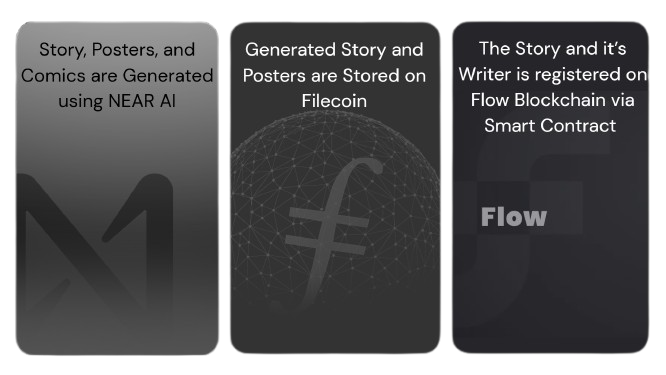

# Comics.ai - TikTok for readers and Writers

Unlock a world of stories and comics instantly. Our dApp offers effortless Google login, personalized browsing, and an immersive reading experience, making every journey into imagination seamless and enjoyable powered by Near AI, Filecoin and Flow Blockchain.

## 🚀 Live Demo & Contract

Here's how you can learn more about Comics.ai:

* **Comics.ai Platform Demo:** [Try it out now!](https://comics-ai.vercel.app/)
* **Smart Contract Overview:** Explore the core contract on [Flow Explorer](https://evm.flowscan.io/address/0x98Fa81BFea72C4601737D4a49E7fa2d7Ca387398?tab=contract).
    * *Address:* `0x98Fa81BFea72C4601737D4a49E7fa2d7Ca387398`
* **Live Story Publishing:** Witness blockchain interactions in real-time by [monitoring transactions](https://evm.flowscan.io/address/0x98Fa81BFea72C4601737D4a49E7fa2d7Ca387398?tab=txs).

## 🌟 What We Built

A **complete decentralized comic creation and publishing platform** that combines:

- AI-Powered Story Generation using NEAR AI
- Story Publishing & Writer's Registration via Smart Contracts on Flow Mainnet
- Story Artifacts Storage on Filecoin through Lighthouse Storage
- Interactive Reading Experience with a TikTok style scroll-to-read UI for immersive engagement

## ⚡ Quick Start - Try It Now!

- **Connect Wallet**: Visit our demo and connect to Flow Mainnet via Privy
- **Create Story**: Go to `/producer` → Define characters & story plot
- **Generate**: Let our NEAR AI Agent create your story and character images and show the magic
- **Publish**: Upload to Filecoin and public the story on Flow Mainnet via our Smart Contract
- **Read**: Read and Chill 

## 🏗 Complete Architecture

```mermaid
graph TD
    A[🎨 User Creates Story] --> B[🤖 NEAR AI Generates Content]
    B --> C[🖼️ Review the AI generated Story]
    C --> D[🌐 Upload to Filecoin via Lighthouse Storage]
    D --> E[⛓️ Publish Story via Smart contract deployed on Flow Mainnet]
    E --> F[📚 Story Live on Comics.ai]
    F --> G[👥 Users Swipe and Scroll to Read]
```



## 🔗 Blockchain Integrations

### � NEAR AI Integration

- **Story Generation**: Advanced language models for Chapter wise story and Comic Creation
- **Character Images**: AI-generated character illustrations
- **Streaming API**: Real-time content generation
- **Implementation**: [`src/lib/near-ai.ts`](src/lib/near-ai.ts)

### 🔵 Flow Blockchain Integration

- **Smart Contract**: Story metadata publishing and indexing
- **Deployed Smart Contract**: [View on Explorer](https://evm.flowscan.io/address/0x98Fa81BFea72C4601737D4a49E7fa2d7Ca387398?tab=contract)
- **Transaction History**: [Monitor Activity](https://evm.flowscan.io/address/0x98Fa81BFea72C4601737D4a49E7fa2d7Ca387398?tab=txs)
- **Implementation**: [`src/components/contract/contractDetails.tsx`](src/components/contract/contractDetails.tsx)

### 🟡 Filecoin and Lighthouse Integration

- **Decentralized Storage**: Storing Story Metadata (Avg. 30 MB per Story)
- **Asset Management**: Images, text, and metadata storage
- **Gateway Access**: `https://gateway.lighthouse.storage/ipfs/{hash}`
- **Implementation**: [`src/lib/lighthouse.ts`](src/lib/lighthouse.ts)

## ✨ Key Features & Innovation

### � Complete Workflow

1. **Story Creation**: AI-powered story generation using NEAR AI
2. **Image Generation**: Character and scene illustrations creation via NEAR AI
3. **Content Upload**: Store all assets on Filecoin via Lighthouse Storage
4. **Smart Contract Integration**: Publish story metadata to Flow blockchain
5. **Read and Chill**: Browse and read stories fetched from onchain data

### 🎯 Core Features

- **AI Story Generation**: Create complete stories with characters and plots
- **Character Creation**: Generate custom characters with AI-generated images
- **Decentralized Publishing**: Stories stored on Filecoin and indexed on Flow
- **Interactive Reader**: Immersive reading experience with image and text modes
- **Wallet Integration**: Seamless Web3 authentication via Privy

## 🛠 Tech Stack



- **Next.js 15** - React framework with App Router
- **React 19** - Latest React features
- **TypeScript** - Type-safe development
- **Tailwind CSS** - Responsive styling
- **Framer Motion** - Smooth animations
- **Solidity** - Smart Contract development

## � Quick Start

### Prerequisites

- Node.js 18+
- Flow wallet (for blockchain interactions)
- Environment variables:
  ```env
  NEAR_AI_API_URL=https://api.near.ai/v1/chat/completions
  NEXT_PUBLIC_LIGHTHOUSE_API_KEY=your_lighthouse_key
  ```

### Installation

```bash
# Clone the repository
git clone https://github.com/your-repo/anon-reader.git

# Install dependencies
npm install

# Run development server
npm run dev

# Open http://localhost:6009
```

### 🎮 Demo Features

**Try It Out:**

1. **Connect Wallet**: Use Privy to connect your Flow wallet
2. **Create Story**: Navigate to `/producer` to create AI-generated stories
3. **Publish**: Upload to Filecoin and publish to Flow blockchain
4. **Read**: Browse and read published stories from the decentralized network

**Sample Story Creation Flow:**

1. Define characters, plot, and themes
2. Generate story content using NEAR AI
3. Create character images with AI
4. Upload all content to Lighthouse (Filecoin)
5. Publish story hash to Flow smart contract
6. Story becomes available in decentralized browse page

## �🔧 Integration Details

### NEAR AI Configuration

```typescript
// src/constants/constants.ts
export const NEAR_AI_CONFIG = {
  API_URL: "https://api.near.ai/v1/chat/completions",
  IMAGE_API_URL: "https://api.near.ai/v1/images/generations",
  MODEL: "fireworks::accounts/fireworks/models/deepseek-v3",
  IMAGE_MODEL:
    "fireworks::accounts/fireworks/models/playground-v2-1024px-aesthetic",
};
```

### Flow Smart Contract

```solidity
// Contract Address: 0x98Fa81BFea72C4601737D4a49E7fa2d7Ca387398
function publishStory(string memory _cid) public {
    // Publishes story CID and register writer to Flow blockchain
}
```

**Live Contract Explorer Links:**

- **📋 Contract Details**: [View on Flow Explorer](https://evm.flowscan.io/address/0x98Fa81BFea72C4601737D4a49E7fa2d7Ca387398?tab=contract) - View the deployed smart contract code, ABI, and contract verification details
- **📊 Transaction History**: [View Transactions](https://evm.flowscan.io/address/0x98Fa81BFea72C4601737D4a49E7fa2d7Ca387398?tab=txs) - Monitor all story publishing transactions and contract interactions in real-time

### Lighthouse Storage

```typescript
// Upload to Filecoin via Lighthouse
const dataURL = await uploadBase64ToLighthouse(base64Data);
// Returns: https://gateway.lighthouse.storage/ipfs/{hash}
```

## Project Structure

```
src/
├── app/                    # Next.js App Router pages
│   ├── api/               # API routes
│   │   ├── stories/       # Story generation endpoints
│   │   └── upload-lighthouse/ # Filecoin upload endpoint
│   ├── producer/          # Story creation interface
│   └── story/[id]/        # Story viewer pages
├── components/
│   ├── contract/          # Flow blockchain integration
│   │   └── contractDetails.tsx
│   └── producer/          # Story creation components
├── lib/
│   ├── near-ai.ts        # NEAR AI integration
│   ├── lighthouse.ts     # Filecoin/Lighthouse storage
│   └── types.ts          # TypeScript definitions
└── constants/
    └── constants.ts      # Configuration constants
```

## 📜 License

This project is built for hackathon demonstration purposes only.
